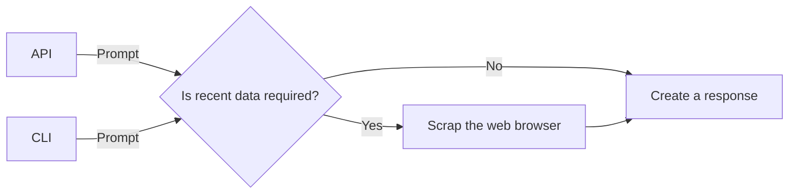

# prompt-checking

This AI demo is inspired by the excellent tutorial from [Adam Lucek](https://www.youtube.com/watch?v=9K51Leyv3qI). The application accepts a prompt through either the CLI or API and uses AI to determine whether it needs to scrape the web for recent data. It then processes the prompt and returns a response. While this is a minimal use case, it allows us at Resonate to demonstrate how to use the two types of schedulers in our SDK: the production scheduler, which is multithreaded and designed for processing use cases, and the DST scheduler, intended for testing your application by verifying business invariants in the presence of partial failures and concurrent usage.

The use case flow looks like this:



Expressed likewise in code:

```py
def use_case(ctx: Context, query: str) -> Generator[Yieldable, Any, str | None]:
    websearch_info: str | None = None
    if (yield ctx.call(check_if_websearch_is_required, query=query)):
        results: list[dict[str, str]] = yield ctx.call(
            query_duckduckgo, query=query, max_results=25
        )
        websearch_info = format_results(results)

    return (
        yield ctx.call(
            reply_query_based_on_info,
            query=query,
            info=websearch_info,
        )
    )
```

At Resonate, we believe that while unit testing is valuable, it does not guarantee system correctness. Achieving system correctness involves ensuring that business invariants are consistently or eventually met, even in the presence of partial failures or concurrent usage.

In this application, our invariant is: **Never return an unreasonable response**. Since AI can sometimes generate hallucinated responses, our system correctness is ensured by guaranteeing that the responses we provide are always reasonable. (Testing AI with AI)

```py
@pytest.mark.parametrize(
    "scheduler",
    resonate.testing.dst(
        seeds=[range(2)],
        mocks={
            prompt_checking.query_duckduckgo: prompt_checking.testing.mocks.query_duckduckgo,  # noqa: E501
        },
    ),
)
def test_not_reasonable_responses(scheduler: DSTScheduler) -> None:
    scheduler.deps.set("model", "llama3.1")
    scheduler.deps.set("duckduckgo_client", DDGS())
    input_prompt = "teleperformance news"
    scheduler.add(prompt_checking.use_case, query=input_prompt)
    response: str = scheduler.run()[0].result()
    _assert_is_a_reasonable_response(
        input_prompt=input_prompt, response=response, model=scheduler.deps.get("model")
    )
```

In this test, we mock our web scraping function so that the DSTScheduler substitutes the production prompt_checking.query_duckduckgo function with the prompt_checking.testing.mocks.query_duckduckgo function during testing. Finally, we assert that the response is reasonable, ensuring our system meets the invariant.

Finally, `ollama` offers a feature that enables classic unit testing. Since GenAI models are pseudo-random, `ollama` allows users to optionally pass a seed, ensuring that the same prompt **always yields the same response**. The `resonate.Context` class propagates the `DSTScheduler` seed, allowing you to make your pseudo-random use cases deterministic.

```py
@pytest.mark.parametrize(
    "scheduler",
    resonate.testing.dst(
        seeds=[1],
        mocks={
            prompt_checking.query_duckduckgo: prompt_checking.testing.mocks.query_duckduckgo,  # noqa: E501
        },
    ),
)
def test_deterministic_prompt_generation(scheduler: DSTScheduler) -> None:
    scheduler.deps.set("model", "llama3.1")
    scheduler.deps.set("duckduckgo_client", DDGS())
    scheduler.add(prompt_checking.use_case, query="home depot news")
    assert (
        scheduler.run()[0].result()
        == "..."  # noqa: E501
    )

```
## How to run

### Using [rye](https://rye.astral.sh) (Recommended)

1. Setup project's virtual environment and install dependencies
```zsh
rye sync
```

2. Run tests
```zsh
rye test
```

### Using pip

1. Install dependencies
```zsh
pip install -r requirements-dev.lock
```

4. Run tests
```zsh
pytest
```

### CLI
```zsh
rye run ai-demo search "lastest news olympic games winner"
```

### API
1. Server up
```zsh
rye run ai-demo up
```
2. curl
```zsh
curl -X 'POST' \
  'http://127.0.0.1:8000/search' \
  -H 'accept: application/json' \
  -H 'Content-Type: application/json' \
  -d '{
  "query": "lastest news olympic games winner"
}'
```